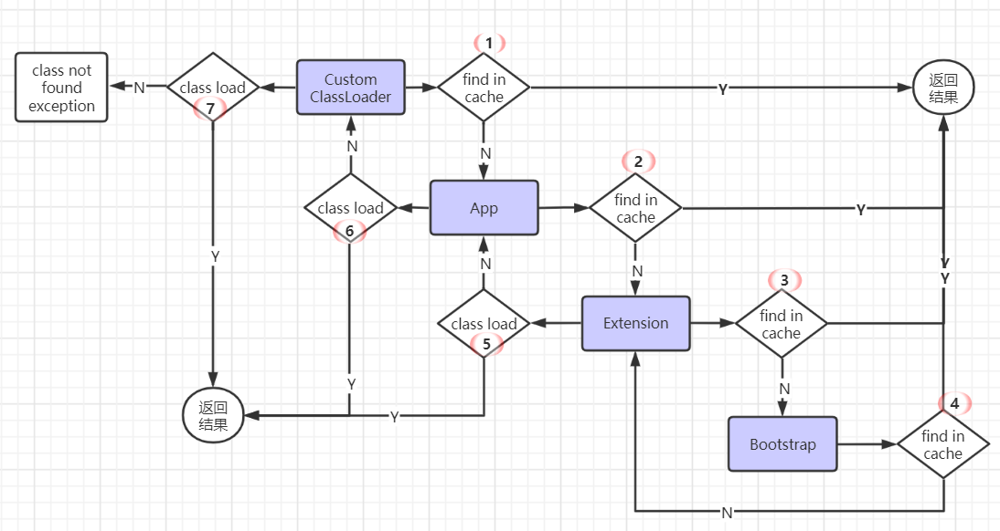
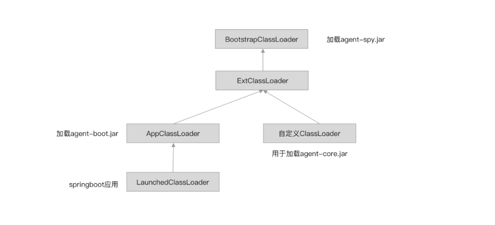
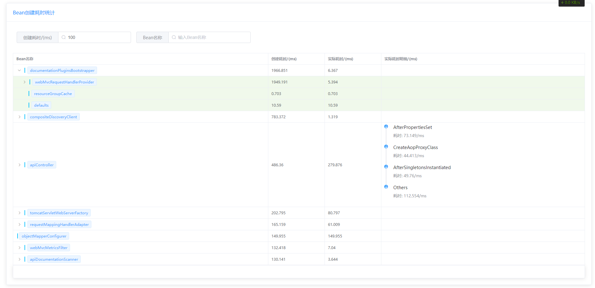
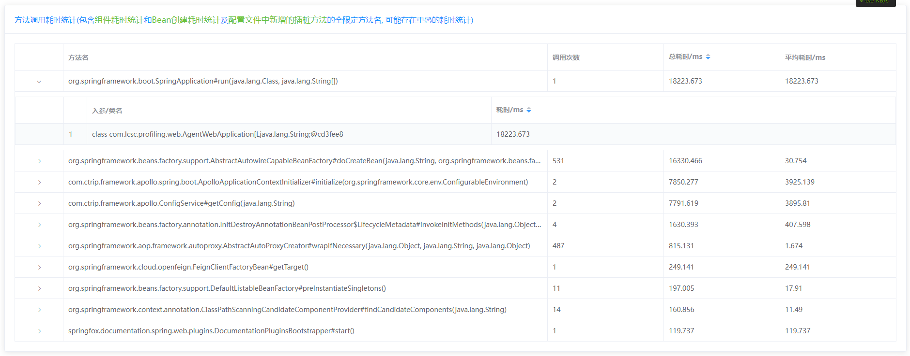
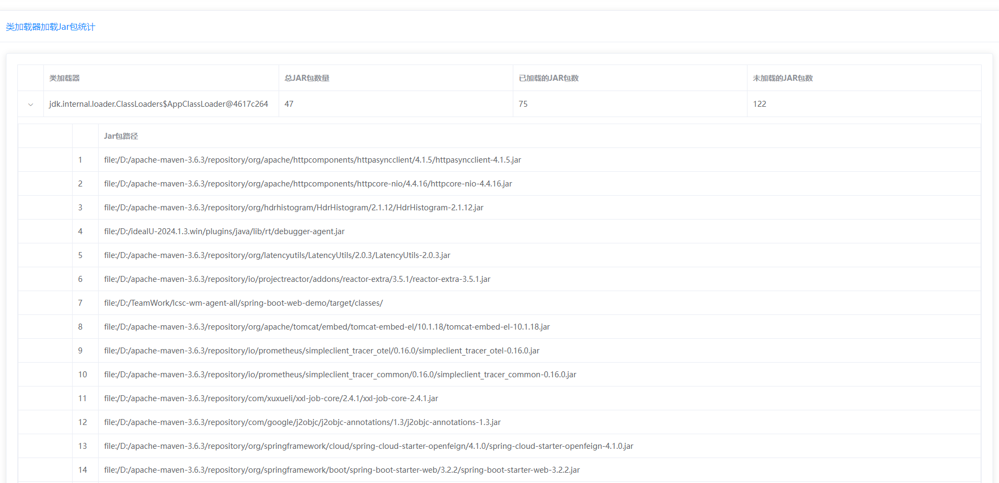
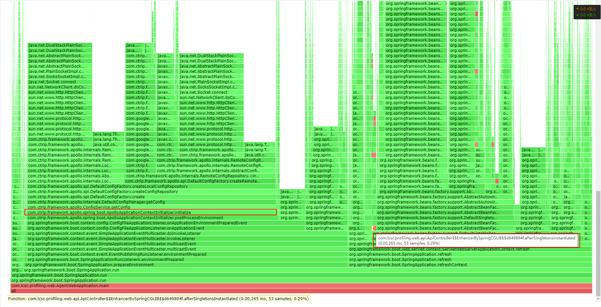
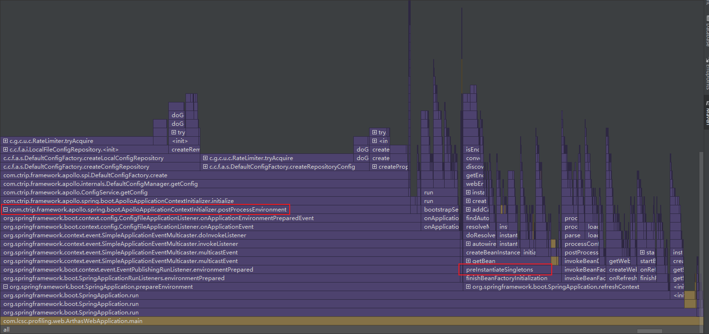

# 文档说明

## 1. 整体技术框架

> 1.`SpringAgent`基于SpringBoot框架开发, 致力于开发出一套对程序员友好, 上手难度和学习成本低的字节插桩组件. 本文不深入探讨源码细节

* 主要技术
    * `JDK1.8-JavaAgent`
    * `Spring Boot-2.3.12.RELEASE`
    * `ByteKit-0.0.9`


* 兼容性  
  `Spring Agent` 项目可分析基于以下框架开发的SpringBoot应用, 其它版本需自行测试

  | 技术组件        | 已测试版本                               |
  |-------------|----------------------------------------------|
  | JDK         | JDK1.8 至 JDK21                              |
  | Spring Boot | `2.3.12.RELEASE`, `3.2.2`  (理论支持所有版本) |

> 2. Classloader类加载介绍

1. 类加载双亲委派模型(最先从BootstrapClassLoader加载类)  
   BootstrapClassLoader(引导类加载器) ==>> ExtClassLoader(扩展类加载器) ==>> AppClassLoader(应用类加载器) ==>>
   CustomClassLoader(用户自定义类加载器)



- 遵循双亲委派机制的应用场景:
    - 1.`java -jar` 启动SpringBoot应用使用的类加载器  
      `SpringBoot3.2.0版本及更高版本 ==>> org.springframework.boot.loader.launch.LaunchedClassloader`  
      `SpringBoot3.2.0版本以下 ==>> org.springframework.boot.loader.LaunchedURLClassLoader`
    - 2.IDEA启动SpringBoot项目所使用的类加载器  
      `sun.misc.Launcher.AppClassLoader`
- 打破双亲委派机制的应用场景:
    - Apache Tomcat (自定义类加载器实现WEB应用之间的隔离)  
      org.apache.catalina.loader.WebappClassLoader
    - JDK的SPI机制 (优先从线程类加载器中加载实现类)
      ```java
       //例如: Jdbc加载驱动时使用ServiceLoader优先从线程类加载器中加载实现类
      public static <S> ServiceLoader<S> load(Class<S> service) {
          //使用用户自定义类加载器加载实现
         ClassLoader cl = Thread.currentThread().getContextClassLoader();
         return ServiceLoader.load(service, cl);
      }
       ```

> 3. JavaAgent介绍

JavaAgent是一种特殊的Java程序，是Instrumentation的客户端。它与普通Java程序通过main方法启动不同，JavaAgent并不是一个可以单独启动的程序，它必须依附在一个Java应用程序（JVM）上，与主程序运行在同一个进程中，启动应用时在JVM启动参数上通过javaagent命令挂载agent程序,
通过Instrumentation API与虚拟机交互，可实现运行时修改类加载器中已加载的类字节码。

* Java Agent 的应用场景
    * IntelliJ IDEA代码调试功能
    * IntelliJ IDEA插件: Mybatis Log
    * 热部署功能: JRebel, XRebel, spring-loaded
    * 线上诊断工具: Btrace, Greys, <button style='color:green'>Arthas</button>
    * JVM性能分析工具: Visual VM, JConsole 等
    * 全链路性能检测工具，例如 Skywalking、Pinpoint等
    * JAVA软件破解: 网上流传的部分IDEA破解方案

> 4. `Spring Agent` 类加载器工作原理

* 使用 `javaagent` 技术将 `agent-spy.jar` 挂载到 `BootstrapClassLoader` 类加载器后面, agent-spy.jar包是 `用户应用`
  与 `SpringAgent` 之间唯一的交互桥梁
* 目前不支持多次对同一个类的字节码增强, 只有第一次字节码增强有效!!!
* 工作原理图
  

## 2. 功能描述

### 2.1  方法调用耗时统计

1. com.lcsc.wm.agent.framework.advisor.AbstractMethodInvokePointcutAdvisor 位于`lcsc-wm-agent-framework`包, 是本项目的核心
2. 方法调用耗时统计功能基于 com.lcsc.wm.agent.framework.advisor.AbstractMethodInvokePointcutAdvisor 的衍生类
   com.lcsc.wm.agent.core.advisor.SimpleMethodInvokePointcutAdvisor开发
3. Bean创建耗时统计及组件加载耗时统计功能基于com.lcsc.wm.agent.core.advisor.SimpleMethodInvokePointcutAdvisor开发

* 即: 方法调用耗时统计功能是本项目的核心(SimpleMethodInvokePointcutAdvisor), Bean创建耗时统计功能 及 组件加载耗时统计功能都是基于此开发

### 2.2 Bean创建耗时统计

> 1. 对创建Bean的方法进行插桩
     SpringBoot创建Bean的方法如下, 我们只需要对这个方法进行插桩监听就可以完成对Bean创建耗时信息的采集和统计. (
     JDK使用Stack来实现帧栈的先进后出, 所以用同样的方式来保存Bean的创建轨迹)



| 被插桩方法名                                                                                                                                                                                        | 用途     |
|-----------------------------------------------------------------------------------------------------------------------------------------------------------------------------------------------|--------|
| org.springframework.beans.factory.support.AbstractAutowireCapableBeanFactory#doCreateBean(java.lang.String, org.springframework.beans.factory.support.RootBeanDefinition, java.lang.Object[]) | 创建Bean |

> 2. Bean创建流程又可以细分成多个子流程, 以下列出了子流程中较为耗时的生命周期节点:

| 被插桩方法名                                                                                                                                     | 用途                                                                                                                                                                                               |
|--------------------------------------------------------------------------------------------------------------------------------------------|--------------------------------------------------------------------------------------------------------------------------------------------------------------------------------------------------|
| org.springframework.beans.factory.annotation.AutowiredAnnotationBeanPostProcessor#postProcessProperties                                    | IOC的核心类之一, 主要用于处理@Autowired注解, 解决依赖注入问题, 应用中创建的Bean越多, 完成依赖注入的耗时占比也会更多. (结合实际项目开发来讲, 这部分的耗时基本上没有可优化的空间, 所以可以忽略)                                                                                  |
| org.springframework.beans.factory.annotation.InitDestroyAnnotationBeanPostProcessor.LifecycleMetadata#invokeDestroyMethods                 | 1. Bean的初始化:  <br/> (1). @PostConstruct<br/> (2).org.springframework.beans.factory.InitializingBean <br/> <br/>2. @Resource属性注入(类似@Autowired) (SpringBoot项目启动不会触发Destroy生命周期, 所以可以忽略Destroy生命周期) |
| org.springframework.aop.framework.autoproxy.AbstractAutoProxyCreator#wrapIfNecessary(java.lang.Object, java.lang.String, java.lang.Object) | 用JDK动态代理或者Cglib字节码代理技术对即将注入到容器中的类实例进行增强(容器中的@Aspectj切面类越多, 应用程序需要越多的时间扫描候选类及生成代理类! @Aspectj不是银弹, 切勿肆意使用)                                                                                         |
| org.springframework.beans.factory.support.DefaultListableBeanFactory#preInstantiateSingletons()                                            | 容器中的Bean创建完成后, 会调用实现了该接口的类方法, 和第二点作用相似 (rocketmq-spring-boot-starter中就是使用该接口来启动生产者和消费者)                                                                                                          |

> 3. 创建Bean耗时统计示意图



### 2.3  组件加载耗时统计

> 1. 以外贸团队目前使用的SpringCloud技术栈入手, 我们借助本项目的核心技术之一 `javaagent`,
     对项目启动流程中耗时占比较高的技术组件中较为耗时的类方法进行插桩埋点

* 技术栈列表及耗时方法埋点

| 用途      | 组件名                                                  | 被插桩的全限定方法名                                                                                                                                  | 描述                                                                                                                        |
|---------|------------------------------------------------------|---------------------------------------------------------------------------------------------------------------------------------------------|---------------------------------------------------------------------------------------------------------------------------|
| 注册中心    | Nacos                                                | -                                                                                                                                           | -                                                                                                                         |
| 配置中心    | <font color="red">Apollo</font>                      | com.ctrip.framework.apollo.spring.boot.ApolloApplicationContextInitializer.initialize(org.springframework.core.env.ConfigurableEnvironment) | 根据Apollo的配置, 配置会在EnvironmentPostProcessor或ApplicationContextInitializer完成加载, 如果应用需加载多个命名空间, 那么Apollo会花费大量时间串行加载配置         |
| 熔断      | Hystrix                                              | -                                                                                                                                           | -                                                                                                                         |
| 限流      | Sentinel                                             | -                                                                                                                                           | -                                                                                                                         |
| 远程调用    | <font color="red">OpenFeign</font>                   | org.springframework.cloud.openfeign.FeignClientFactoryBean#getTarget()                                                                      | 每个@FeignClient接口都会相应的生成一个JDK动态代理类, 且会单独创建一个AnnotationConfigApplicationContext上下文, 当应用包含大量Feign接口, 耗时就会从量变形成质变             |
| API接口文档 | <font color="red">Swagger</font>                     | springfox.documentation.spring.web.plugins.DocumentationPluginsBootstrapper#start()                                                         | 当应用对外暴露的接口数量较多时, Swagger组件扫描包, 解析Controller方法和注解等会消耗大量时间                                                                  |
| AOP切面   | <font color="red">Spring-Aop (@Aspect切面或原生切面)</font> | org.springframework.aop.framework.autoproxy.AbstractAutoProxyCreator#wrapIfNecessary(java.lang.Object, java.lang.String, java.lang.Object)  | 如果开发大型应用使用 @Aspectj + 通配符表达式或者方法级别的注解来实现切面, 类的所有方法都会被遍历解析一遍, 从而确定哪些方法需要被增强! 确定需要被增强, 则通过JDK动态代理或Cglib生成新的代理类, 这个过程也需要一些时间 |
| 其它      | ......                                               | -                                                                                                                                           | -                                                                                                                         |

* 由该类异步采集组件方法耗时数据并进行聚合:

  ```
  com.lcsc.wm.agent.plugin.core.analysis.component.ComponentInitializedListener
  ```

### 2.4 类加载器加载Jar包分析

> 1. 借助 `Spring Agent` 类加载器加载Jar包列表, 可辅助分析哪些jar包可废弃, 废弃jar包可减少类加载器扫描类的耗时, 从而提高启动速度

* 示例
  

### 2.5 性能分析火焰图

> 1. 借助 `Spring Agent` 绘制性能火焰图来分析热点代码

* 修改 application-agent.yml 配置, 然后启动项目, 启动完成后访问前端页面地址

```yaml
spring:
  agent:
    #火焰图数据采集, 默认不开启
    flame-graph:
      #启用性能火焰图
      enabled: true
      #开启高精度模式会关闭方法耗时统计功能, 且将采样间隔interval强制置为1ms
      high-precision: true
      #需要高亮展示的帧栈 默认只要包名包含了 .lcsc. 都会高亮展示 
      highlight-package: '.lcsc.'
      #被采样的线程名(日常开发中, 几乎都是通过main方法启动SpringBoot应用)
      names: main
      #采样间隔/ms, 间隔越低精度越高
      interval: 5
```

* 观测高耗时栈帧:  
  
    1. 左一为阿波罗加载配置的耗时.
    2. 左二为包含公司组织名的代码帧栈`.lcsc.`  , 被高亮展示
    3. 当链路调用较深时需要双击栈帧, 然后分析栈帧明细.

> 2. 借助IDEA自带的性能分析火焰图分析热点代码

* 新版本IDEA, 通过如下按钮启动项目也能完成性能火焰图的绘制.  
  

* 观测高耗时栈帧(只列出了浅层帧栈):  
  
    1. 左一为阿波罗加载配置的总耗时.
    2. 左二为 调用 org.springframework.beans.factory.SmartInitializingSingleton#afterSingletonsInstantiated()接口的总耗时.
    3. 当链路调用较深时, 需要将折叠的栈帧展开, 才能定位到隐藏在深层的耗时帧栈.
